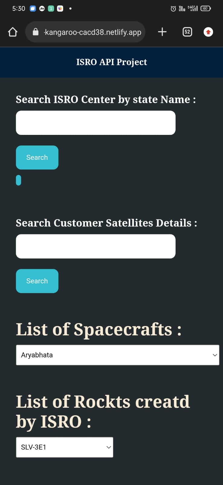

# ISRO Launch Finder
This project uses the ISRO API to fetch data about launches, rockets, and customer satellites. It was created using HTML, CSS, and JavaScript, and it is fully mobile responsive.

# Features
- Launch search: The project allows users to search for ISRO launches by name or by date range.
- Rocket search: The project allows users to search for ISRO rockets by name or by launch date.
- Customer satellite search: The project allows users to search for ISRO customer satellites by name or by launch date.
- Error handling: The project handles errors gracefully and displays an error message if the data cannot be fetched or if there is an API error.

# Live Link
# [Click Here](https://extraordinary-kangaroo-cacd38.netlify.app)

# Laptop View
.png)

# Mobile View

# Contributing
If you would like to contribute to this project, you can fork the repository and create a pull request with your changes. You can also open an issue if you find any bugs or have any suggestions for improvements.

# Credits
This project was created by Ashish with the help of the ISRO API and JavaScript , CSS.