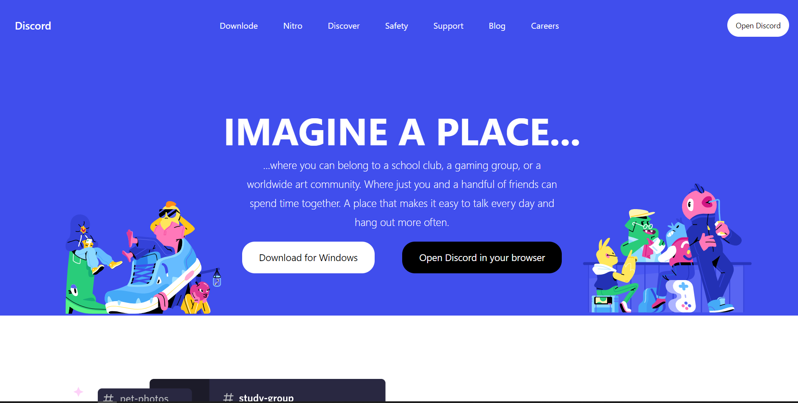
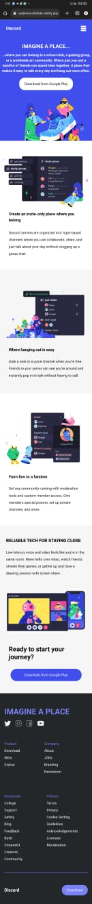

# Discord Website Clone
This project is a clone of the Discord website home page. It was created using HTML and Tailwind CSS, and it does not have any backend functionality.

# Features
- Responsive design: The website is mobile responsive and can be viewed on different screen sizes.
- Accurate layout: The website closely resembles the original Discord website in terms of layout and design.
- Easy to customize: The website can be easily customized by modifying the HTML and CSS files.

# Live Link
## [Click Here](https://gentle-madeleine-6b06de.netlify.app)

# Laptop View

# Mobile View

# Installation
To run this project, you can simply clone the repository or download the ZIP file. Then, open the index.html file in your web browser to view the website.

`git clone https://github.com/your-username/discord-clone.git`

# Usage
Once you have opened the index.html file, you can navigate the website and view its different sections. The website is designed to be easy to use and navigate, just like the original Discord website.

# Contributing
If you would like to contribute to this project, you can fork the repository and create a pull request with your changes. You can also open an issue if you find any bugs or have any suggestions for improvements.

# Credits
This project was created by Ashish with the help of Tailwind CSS and HTML.